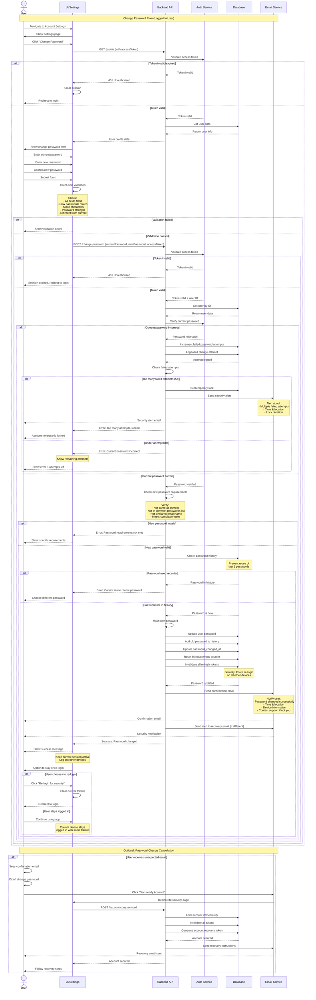

```mermaid
sequenceDiagram
    actor User
    participant UI as UI/Settings
    participant API as Backend API
    participant Auth as Auth Service
    participant DB as Database
    participant Email as Email Service

    Note over User,Email: Change Password Flow (Logged In User)
    
    User->>UI: Navigate to Account Settings
    UI->>User: Show settings page
    User->>UI: Click "Change Password"
    
    UI->>API: GET /profile (with accessToken)
    API->>Auth: Validate access token
    
    alt Token invalid/expired
        Auth-->>API: Token invalid
        API-->>UI: 401 Unauthorized
        UI->>UI: Clear session
        UI-->>User: Redirect to login
    else Token valid
        Auth-->>API: Token valid
        API->>DB: Get user data
        DB-->>API: Return user info
        API-->>UI: User profile data
        UI->>User: Show change password form
        
        User->>UI: Enter current password
        User->>UI: Enter new password
        User->>UI: Confirm new password
        User->>UI: Submit form
        
        UI->>UI: Client-side validation
        Note over UI: Check:<br/>- All fields filled<br/>- New passwords match<br/>- Min 8 characters<br/>- Password strength<br/>- Different from current
        
        alt Validation failed
            UI-->>User: Show validation errors
        else Validation passed
            UI->>API: POST /change-password (currentPassword, newPassword, accessToken)
            
            API->>Auth: Validate access token
            
            alt Token invalid
                Auth-->>API: Token invalid
                API-->>UI: 401 Unauthorized
                UI-->>User: Session expired, redirect to login
            else Token valid
                Auth-->>API: Token valid + user ID
                
                API->>DB: Get user by ID
                DB-->>API: Return user data
                
                API->>Auth: Verify current password
                
                alt Current password incorrect
                    Auth-->>API: Password mismatch
                    
                    API->>DB: Increment failed password attempts
                    API->>DB: Log failed change attempt
                    DB-->>API: Attempt logged
                    
                    API->>API: Check failed attempts
                    
                    alt Too many failed attempts (5+)
                        API->>DB: Set temporary lock
                        API->>Email: Send security alert
                        Note over Email: Alert about:<br/>- Multiple failed attempts<br/>- Time & location<br/>- Lock duration
                        Email-->>User: Security alert email
                        
                        API-->>UI: Error: Too many attempts, locked
                        UI-->>User: Account temporarily locked
                    else Under attempt limit
                        API-->>UI: Error: Current password incorrect
                        Note over UI: Show remaining attempts
                        UI-->>User: Show error + attempts left
                    end
                else Current password correct
                    Auth-->>API: Password verified
                    
                    API->>API: Check new password requirements
                    Note over API: Verify:<br/>- Not same as current<br/>- Not in common passwords list<br/>- Not similar to email/name<br/>- Meets complexity rules
                    
                    alt New password invalid
                        API-->>UI: Error: Password requirements not met
                        UI-->>User: Show specific requirements
                    else New password valid
                        API->>DB: Check password history
                        Note over DB: Prevent reuse of<br/>last 5 passwords
                        
                        alt Password used recently
                            DB-->>API: Password in history
                            API-->>UI: Error: Cannot reuse recent password
                            UI-->>User: Choose different password
                        else Password not in history
                            DB-->>API: Password is new
                            
                            API->>API: Hash new password
                            
                            API->>DB: Update user password
                            API->>DB: Add old password to history
                            API->>DB: Update password_changed_at
                            API->>DB: Reset failed attempts counter
                            API->>DB: Invalidate all refresh tokens
                            Note over DB: Security: Force re-login<br/>on all other devices
                            DB-->>API: Password updated
                            
                            API->>Email: Send confirmation email
                            Note over Email: Notify user:<br/>- Password changed successfully<br/>- Time & location<br/>- Device information<br/>- Contact support if not you
                            Email-->>User: Confirmation email
                            
                            API->>Email: Send alert to recovery email (if different)
                            Email-->>User: Security notification
                            
                            API-->>UI: Success: Password changed
                            UI-->>User: Show success message
                            
                            Note over UI: Keep current session active<br/>Log out other devices
                            
                            UI->>User: Option to stay or re-login
                            
                            alt User chooses to re-login
                                User->>UI: Click "Re-login for security"
                                UI->>UI: Clear current tokens
                                UI-->>User: Redirect to login
                            else User stays logged in
                                User->>UI: Continue using app
                                Note over UI: Current device stays<br/>logged in with same tokens
                            end
                        end
                    end
                end
            end
        end
    end

    Note over User,Email: Optional: Password Change Cancellation
    
    alt User receives unexpected email
        User->>User: Sees confirmation email
        User->>User: Didn't change password
        User->>Email: Click "Secure My Account"
        Email->>UI: Redirect to security page
        UI->>API: POST /account-compromised
        
        API->>DB: Lock account immediately
        API->>DB: Invalidate all tokens
        API->>DB: Generate account recovery token
        DB-->>API: Account secured
        
        API->>Email: Send recovery instructions
        Email-->>User: Recovery email sent
        
        API-->>UI: Account secured
        UI-->>User: Follow recovery steps
    end
```