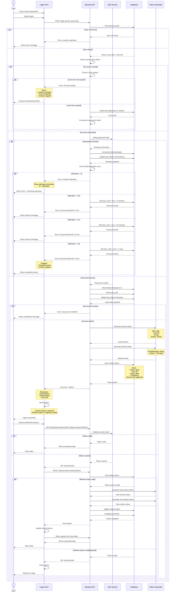

```mermaid
sequenceDiagram
    actor User
    participant UI as Login Form
    participant API as Backend API
    participant Auth as Auth Service
    participant DB as Database
    participant Token as Token Generator

    User->>UI: Enter email & password
    User->>UI: Submit login
    UI->>API: POST /login (email, password)
    
    API->>DB: Find user by email
    
    alt User not found
        DB-->>API: User not found
        API-->>UI: Error: Invalid credentials
        UI-->>User: Show error message
    else User found
        DB-->>API: Return user data + lock info
        
        API->>API: Check account lock status
        
        alt Account is locked
            API->>API: Check if lock expired
            
            alt Lock time not expired
                API-->>UI: Error: Account locked
                Note over UI: Show:<br/>- Locked message<br/>- Time remaining<br/>- Contact support
                UI-->>User: Account temporarily locked
            else Lock time expired
                API->>DB: Reset lock (attempts=0, unlock)
                DB-->>API: Lock reset
                API->>API: Continue to password check
            end
        else Account not locked
            API->>Auth: Verify password hash
            
            alt Password incorrect
                Auth-->>API: Password mismatch
                
                API->>DB: Increment failed attempts
                API->>DB: Update last_failed_at timestamp
                DB-->>API: Attempts updated
                
                API->>API: Check failed attempts count
                
                alt Attempts < 3
                    API-->>UI: Error: Invalid credentials
                    Note over UI: Show attempts remaining:<br/>(3 - attempts)
                    UI-->>User: Show error + remaining attempts
                else Attempts = 3-4
                    API->>DB: Set lock_until = now + 5 minutes
                    DB-->>API: Account locked
                    API-->>UI: Error: Account locked for 5 min
                    UI-->>User: Show lockout message
                else Attempts = 5-7
                    API->>DB: Set lock_until = now + 15 minutes
                    DB-->>API: Account locked
                    API-->>UI: Error: Account locked for 15 min
                    UI-->>User: Show lockout message
                else Attempts >= 8
                    API->>DB: Set lock_until = now + 1 hour
                    DB-->>API: Account locked
                    API-->>UI: Error: Account locked for 1 hour
                    Note over UI: Suggest:<br/>- Password reset<br/>- Contact support
                    UI-->>User: Show extended lockout
                end
            else Password correct
                Auth-->>API: Password verified
                
                API->>DB: Reset failed attempts to 0
                API->>DB: Clear lock_until
                API->>DB: Update last_login timestamp
                DB-->>API: Login data updated
                
                alt Account not active
                    API-->>UI: Error: Account not verified
                    UI-->>User: Show verification message
                else Account active
                    API->>Token: Generate access token
                    Note over Token: JWT with:<br/>- User ID<br/>- Email<br/>- Expiry: 15min
                    Token-->>API: Access token
                    
                    API->>Token: Generate refresh token
                    Note over Token: UUID/Random string<br/>- Expiry: 7-30 days
                    Token-->>API: Refresh token
                    
                    API->>DB: Save refresh token
                    Note over DB: Store:<br/>- Token value<br/>- User ID<br/>- Expiry date<br/>- Created at<br/>- Device info (optional)
                    DB-->>API: Token saved
                    
                    API-->>UI: Success + tokens
                    Note over UI: Response:<br/>- accessToken<br/>- refreshToken<br/>- User info
                    UI->>UI: Store tokens
                    Note over UI: - Access token in memory<br/>- Refresh token in httpOnly cookie
                    UI-->>User: Login successful
                    
                    User->>UI: Access protected resource
                    UI->>API: GET /protected (Authorization: Bearer {accessToken})
                    API->>Auth: Validate access token
                    
                    alt Token valid
                        Auth-->>API: Token valid
                        API-->>UI: Return protected data
                        UI-->>User: Show data
                    else Token expired
                        Auth-->>API: Token expired
                        API-->>UI: 401 Unauthorized
                        
                        UI->>API: POST /refresh-token (refreshToken)
                        API->>DB: Find refresh token
                        
                        alt Refresh token valid
                            DB-->>API: Token found & valid
                            API->>Token: Generate new access token
                            Token-->>API: New access token
                            
                            API->>Token: Generate new refresh token
                            Token-->>API: New refresh token
                            
                            API->>DB: Update refresh token
                            API->>DB: Invalidate old token
                            DB-->>API: Tokens updated
                            
                            API-->>UI: New tokens
                            UI->>UI: Update stored tokens
                            UI->>API: Retry request with new token
                            API-->>UI: Return protected data
                            UI-->>User: Show data
                        else Refresh token invalid/expired
                            DB-->>API: Token invalid
                            API-->>UI: 401 Unauthorized
                            UI->>UI: Clear tokens
                            UI-->>User: Redirect to login
                        end
                    end
                end
            end
        end
    end
```