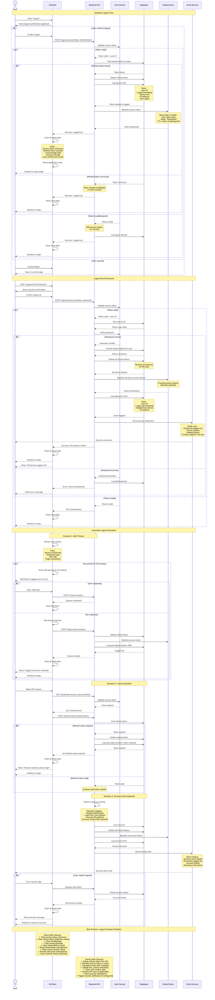

```mermaid
sequenceDiagram
    actor User
    participant UI as UI/Client
    participant API as Backend API
    participant Auth as Auth Service
    participant DB as Database
    participant Cache as Redis/Cache
    participant Email as Email Service

    Note over User,Email: Standard Logout Flow
    
    User->>UI: Click "Logout"
    UI->>User: Show logout confirmation (optional)
    
    alt User confirms logout
        User->>UI: Confirm logout
        
        UI->>API: POST /logout (accessToken, refreshToken)
        
        API->>Auth: Validate access token
        
        alt Token valid
            Auth-->>API: Token valid + user ID
            
            API->>DB: Find refresh token by value
            
            alt Refresh token found
                DB-->>API: Token found
                
                API->>DB: Delete refresh token
                API->>DB: Log logout event
                Note over DB: Store:<br/>- User ID<br/>- Logout timestamp<br/>- Device info<br/>- IP address<br/>- User agent
                DB-->>API: Token deleted & logged
                
                API->>Cache: Blacklist access token
                Note over Cache: Store token in Redis:<br/>- Key: token hash<br/>- Value: "blacklisted"<br/>- TTL: token remaining time
                Cache-->>API: Token blacklisted
                
                API-->>UI: Success: Logged out
                
                UI->>UI: Clear all client data
                Note over UI: Clear:<br/>- Access token (memory)<br/>- Refresh token (cookie)<br/>- Local storage data<br/>- Session storage<br/>- User preferences cache
                
                UI->>UI: Reset application state
                UI-->>User: Redirect to login page
            else Refresh token not found
                DB-->>API: Token not found
                Note over API: Token already invalidated<br/>or never existed
                API-->>UI: Success: Logged out
                UI->>UI: Clear client data
                UI-->>User: Redirect to login
            end
        else Token invalid/expired
            Auth-->>API: Token invalid
            Note over API: Still process logout<br/>for security
            API->>DB: Log logout attempt
            API-->>UI: Success: Logged out
            UI->>UI: Clear client data
            UI-->>User: Redirect to login
        end
    else User cancels
        User->>UI: Cancel logout
        UI-->>User: Stay on current page
    end

    Note over User,Email: Logout from All Devices
    
    User->>UI: Click "Logout from All Devices"
    UI->>User: Show security confirmation
    User->>UI: Confirm logout all
    
    UI->>API: POST /logout-all (accessToken, password)
    
    API->>Auth: Validate access token
    
    alt Token valid
        Auth-->>API: Token valid + user ID
        
        API->>DB: Get user by ID
        DB-->>API: Return user data
        
        API->>Auth: Verify password
        
        alt Password correct
            Auth-->>API: Password verified
            
            API->>DB: Find all refresh tokens for user
            DB-->>API: Return all tokens
            
            API->>DB: Delete all refresh tokens
            Note over DB: Remove all sessions<br/>for this user
            DB-->>API: All tokens deleted
            
            API->>Cache: Blacklist all active access tokens
            Note over Cache: If tracking active tokens:<br/>Add all to blacklist
            Cache-->>API: Tokens blacklisted
            
            API->>DB: Log logout all event
            Note over DB: Store:<br/>- User ID<br/>- Logout all timestamp<br/>- Initiated from device<br/>- IP address
            DB-->>API: Event logged
            
            API->>Email: Send security notification
            Note over Email: Notify user:<br/>- All devices logged out<br/>- Time & location<br/>- Initiated device<br/>- Contact support if not you
            Email-->>User: Security email sent
            
            API-->>UI: Success: All sessions ended
            
            UI->>UI: Clear all client data
            UI-->>User: Redirect to login
            UI-->>User: Show "All devices logged out"
        else Password incorrect
            Auth-->>API: Password mismatch
            API->>DB: Log failed attempt
            API-->>UI: Error: Incorrect password
            UI-->>User: Show error message
        end
    else Token invalid
        Auth-->>API: Token invalid
        API-->>UI: 401 Unauthorized
        UI->>UI: Clear client data
        UI-->>User: Redirect to login
    end

    Note over User,Email: Automatic Logout Scenarios
    
    Note over UI,API: Scenario 1: Idle Timeout
    
    UI->>UI: Monitor user activity
    Note over UI: Track:<br/>- Mouse movements<br/>- Keyboard input<br/>- API calls<br/>- Page interactions
    
    alt No activity for 30 minutes
        UI->>UI: Show idle warning (5 min before)
        UI-->>User: "Still there? Logging out in 5 min"
        
        alt User responds
            User->>UI: Click "Still here"
            UI->>API: POST /refresh-session
            API-->>UI: Session refreshed
            UI->>UI: Reset idle timer
        else No response
            UI->>UI: Idle timeout reached
            UI->>API: POST /logout (auto-timeout)
            API->>DB: Delete refresh token
            API->>Cache: Blacklist access token
            API->>DB: Log auto-logout (reason: idle)
            DB-->>API: Logged out
            API-->>UI: Session ended
            UI->>UI: Clear all client data
            UI-->>User: Show "Logged out due to inactivity"
            UI-->>User: Redirect to login
        end
    end

    Note over API,DB: Scenario 2: Token Expiration
    
    User->>UI: Make API request
    UI->>API: GET /protected-resource (accessToken)
    
    API->>Auth: Validate access token
    Auth-->>API: Token expired
    
    API-->>UI: 401 Unauthorized
    
    UI->>API: POST /refresh-token (refreshToken)
    API->>DB: Find refresh token
    
    alt Refresh token expired
        DB-->>API: Token expired
        API->>DB: Delete expired token
        API->>DB: Log auto-logout (reason: token expired)
        DB-->>API: Token deleted
        API-->>UI: 401 Refresh token expired
        UI->>UI: Clear all client data
        UI-->>User: Show "Session expired, please login"
        UI-->>User: Redirect to login
    else Refresh token valid
        DB-->>API: Token valid
        Note over API: Continue with token refresh
    end

    Note over API,DB: Scenario 3: Security Event Detected
    
    API->>API: Detect suspicious activity
    Note over API: Detection triggers:<br/>- Multiple failed logins<br/>- Login from new location<br/>- Unusual API patterns<br/>- Account compromise reported
    
    API->>DB: Lock account
    API->>DB: Delete all refresh tokens
    API->>Cache: Blacklist all access tokens
    API->>DB: Log security event
    DB-->>API: Account secured
    
    API->>Email: Send security alert
    Note over Email: Alert contains:<br/>- Security event details<br/>- All devices logged out<br/>- Account locked<br/>- Recovery instructions
    Email-->>User: Security alert email
    
    alt User makes request
        User->>UI: Try to access app
        UI->>API: Request with token
        API->>DB: Check account status
        DB-->>API: Account locked
        API-->>UI: 403 Account locked
        UI->>UI: Clear all client data
        UI-->>User: Show security message
        UI-->>User: Redirect to account recovery
    end

    Note over User,Email: Best Practice: Logout Cleanup Checklist
    
    Note over UI: Client-Side Cleanup:<br/>✓ Clear access token (memory)<br/>✓ Clear refresh token (httpOnly cookie)<br/>✓ Clear localStorage<br/>✓ Clear sessionStorage<br/>✓ Clear IndexedDB (if used)<br/>✓ Reset Redux/state management<br/>✓ Clear service worker cache<br/>✓ Revoke web push subscriptions<br/>✓ Clear browser history (optional)
    
    Note over API: Server-Side Cleanup:<br/>✓ Delete refresh token from DB<br/>✓ Blacklist access token in cache<br/>✓ Log logout event with metadata<br/>✓ Update last_activity timestamp<br/>✓ Clear user session data<br/>✓ Revoke API keys (if applicable)<br/>✓ Send security notifications<br/>✓ Trigger security webhooks (if configured)
```