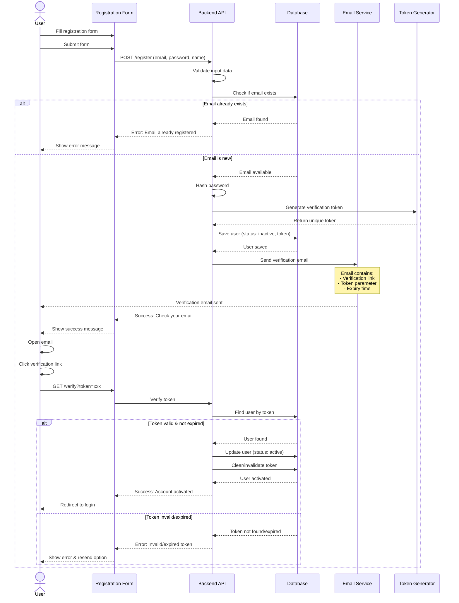

```mermaid
sequenceDiagram
    actor User
    participant UI as Registration Form
    participant API as Backend API
    participant DB as Database
    participant Email as Email Service
    participant Token as Token Generator

    User->>UI: Fill registration form
    User->>UI: Submit form
    UI->>API: POST /register (email, password, name)
    
    API->>API: Validate input data
    API->>DB: Check if email exists
    
    alt Email already exists
        DB-->>API: Email found
        API-->>UI: Error: Email already registered
        UI-->>User: Show error message
    else Email is new
        DB-->>API: Email available
        API->>API: Hash password
        API->>Token: Generate verification token
        Token-->>API: Return unique token
        API->>DB: Save user (status: inactive, token)
        DB-->>API: User saved
        
        API->>Email: Send verification email
        Note over Email: Email contains:<br/>- Verification link<br/>- Token parameter<br/>- Expiry time
        Email-->>User: Verification email sent
        
        API-->>UI: Success: Check your email
        UI-->>User: Show success message
        
        User->>User: Open email
        User->>User: Click verification link
        User->>UI: GET /verify?token=xxx
        UI->>API: Verify token
        
        API->>DB: Find user by token
        
        alt Token valid & not expired
            DB-->>API: User found
            API->>DB: Update user (status: active)
            API->>DB: Clear/invalidate token
            DB-->>API: User activated
            API-->>UI: Success: Account activated
            UI-->>User: Redirect to login
        else Token invalid/expired
            DB-->>API: Token not found/expired
            API-->>UI: Error: Invalid/expired token
            UI-->>User: Show error & resend option
        end
    end
```