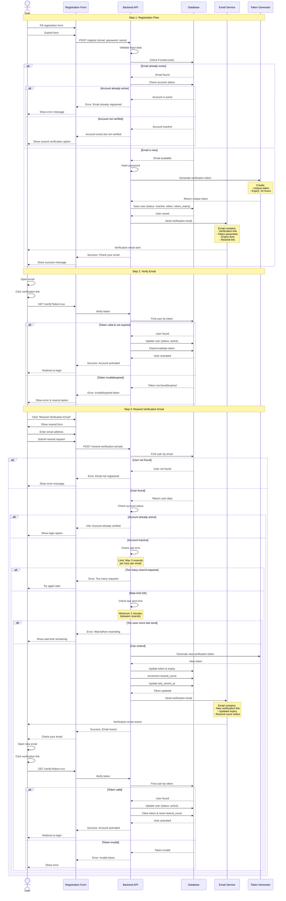

```mermaid
sequenceDiagram
    actor User
    participant UI as Registration Form
    participant API as Backend API
    participant DB as Database
    participant Email as Email Service
    participant Token as Token Generator

    Note over User,Token: Step 1: Registration Flow
    
    User->>UI: Fill registration form
    User->>UI: Submit form
    UI->>API: POST /register (email, password, name)
    
    API->>API: Validate input data
    API->>DB: Check if email exists
    
    alt Email already exists
        DB-->>API: Email found
        API->>DB: Check account status
        
        alt Account already active
            DB-->>API: Account is active
            API-->>UI: Error: Email already registered
            UI-->>User: Show error message
        else Account not verified
            DB-->>API: Account inactive
            API-->>UI: Account exists but not verified
            UI-->>User: Show resend verification option
        end
    else Email is new
        DB-->>API: Email available
        API->>API: Hash password
        API->>Token: Generate verification token
        Note over Token: Create:<br/>- Unique token<br/>- Expiry: 24 hours
        Token-->>API: Return unique token
        API->>DB: Save user (status: inactive, token, token_expiry)
        DB-->>API: User saved
        
        API->>Email: Send verification email
        Note over Email: Email contains:<br/>- Verification link<br/>- Token parameter<br/>- Expiry time<br/>- Resend link
        Email-->>User: Verification email sent
        
        API-->>UI: Success: Check your email
        UI-->>User: Show success message
    end

    Note over User,Token: Step 2: Verify Email
    
    User->>User: Open email
    User->>User: Click verification link
    User->>UI: GET /verify?token=xxx
    UI->>API: Verify token
    
    API->>DB: Find user by token
    
    alt Token valid & not expired
        DB-->>API: User found
        API->>DB: Update user (status: active)
        API->>DB: Clear/invalidate token
        DB-->>API: User activated
        API-->>UI: Success: Account activated
        UI-->>User: Redirect to login
    else Token invalid/expired
        DB-->>API: Token not found/expired
        API-->>UI: Error: Invalid/expired token
        UI-->>User: Show error & resend option
    end

    Note over User,Token: Step 3: Resend Verification Email
    
    User->>UI: Click "Resend Verification Email"
    UI->>User: Show resend form
    User->>UI: Enter email address
    User->>UI: Submit resend request
    
    UI->>API: POST /resend-verification (email)
    
    API->>DB: Find user by email
    
    alt User not found
        DB-->>API: User not found
        API-->>UI: Error: Email not registered
        UI-->>User: Show error message
    else User found
        DB-->>API: Return user data
        
        API->>API: Check account status
        
        alt Account already active
            API-->>UI: Info: Account already verified
            UI-->>User: Show login option
        else Account inactive
            API->>API: Check rate limit
            Note over API: Limit: Max 3 resends<br/>per hour per email
            
            alt Too many resend requests
                API-->>UI: Error: Too many requests
                UI-->>User: Try again later
            else Rate limit OK
                API->>API: Check last sent time
                Note over API: Minimum 2 minutes<br/>between resends
                
                alt Too soon since last send
                    API-->>UI: Error: Wait before resending
                    UI-->>User: Show wait time remaining
                else Can resend
                    API->>Token: Generate new verification token
                    Token-->>API: New token
                    
                    API->>DB: Update token & expiry
                    API->>DB: Increment resend_count
                    API->>DB: Update last_resent_at
                    DB-->>API: Token updated
                    
                    API->>Email: Send verification email
                    Note over Email: Email contains:<br/>- New verification link<br/>- Updated expiry<br/>- Resend count notice
                    Email-->>User: Verification email resent
                    
                    API-->>UI: Success: Email resent
                    UI-->>User: Check your email
                    
                    User->>User: Open new email
                    User->>User: Click verification link
                    User->>UI: GET /verify?token=xxx
                    UI->>API: Verify token
                    
                    API->>DB: Find user by token
                    
                    alt Token valid
                        DB-->>API: User found
                        API->>DB: Update user (status: active)
                        API->>DB: Clear token & reset resend_count
                        DB-->>API: User activated
                        API-->>UI: Success: Account activated
                        UI-->>User: Redirect to login
                    else Token invalid
                        DB-->>API: Token invalid
                        API-->>UI: Error: Invalid token
                        UI-->>User: Show error
                    end
                end
            end
        end
    end
```