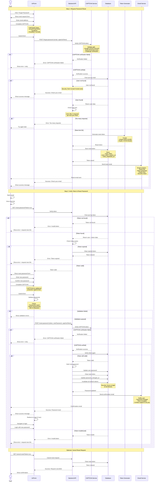

```mermaid
sequenceDiagram
    actor User
    participant UI as UI/Form
    participant API as Backend API
    participant CAPTCHA as CAPTCHA Service
    participant DB as Database
    participant Token as Token Generator
    participant Email as Email Service

    Note over User,Email: Step 1: Request Password Reset
    
    User->>UI: Click "Forgot Password"
    UI->>User: Show reset request form
    User->>UI: Enter email address
    User->>UI: Complete CAPTCHA
    Note over UI: CAPTCHA Types:<br/>- reCAPTCHA v2/v3<br/>- hCaptcha<br/>- Cloudflare Turnstile
    User->>UI: Submit form
    
    UI->>API: POST /forgot-password (email, captchaToken)
    
    API->>CAPTCHA: Verify CAPTCHA token
    Note over CAPTCHA: Validate with:<br/>- Google reCAPTCHA API<br/>- Score threshold check<br/>- Challenge verification
    
    alt CAPTCHA verification failed
        CAPTCHA-->>API: Verification failed
        API-->>UI: Error: CAPTCHA verification failed
        UI-->>User: Show error + retry
    else CAPTCHA verified
        CAPTCHA-->>API: Verification success
        API->>DB: Find user by email
        
        alt User not found
            DB-->>API: User not found
            Note over API: Security: Don't reveal if email exists
            API-->>UI: Success: Check your email
            UI-->>User: Show success message
        else User found
            DB-->>API: Return user data
            
            API->>API: Check rate limit
            Note over API: Limit: Max 3 requests<br/>per hour per email
            
            alt Too many requests
                API-->>UI: Error: Too many requests
                UI-->>User: Try again later
            else Rate limit OK
                API->>Token: Generate reset token
                Note over Token: Create:<br/>- Unique token (UUID)<br/>- Expiry: 15-30 minutes
                Token-->>API: Reset token
                
                API->>DB: Save reset token
                Note over DB: Store:<br/>- reset_token<br/>- reset_token_expires_at<br/>- reset_requested_at
                DB-->>API: Token saved
                
                API->>Email: Send reset email
                Note over Email: Email contains:<br/>- Reset link<br/>- Token parameter<br/>- Expiry time<br/>- Security notice
                Email-->>User: Reset email sent
                
                API-->>UI: Success: Check your email
                UI-->>User: Show success message
            end
        end
    end

    Note over User,Email: Step 2: Verify Token & Reset Password
    
    User->>User: Open email
    User->>User: Click reset link
    User->>UI: GET /reset-password?token=xxx
    
    UI->>API: Verify token
    API->>DB: Find user by token
    
    alt Token not found
        DB-->>API: Token not found
        API-->>UI: Error: Invalid token
        UI-->>User: Show error + request new link
    else Token found
        DB-->>API: Return user + token data
        
        API->>API: Check token expiry
        
        alt Token expired
            API->>DB: Clear expired token
            DB-->>API: Token cleared
            API-->>UI: Error: Token expired
            UI-->>User: Show error + request new link
        else Token valid
            API-->>UI: Token valid
            UI->>User: Show reset password form
            
            User->>UI: Enter new password
            User->>UI: Confirm new password
            User->>UI: Complete CAPTCHA
            Note over UI: CAPTCHA for additional<br/>protection against bots
            User->>UI: Submit form
            
            UI->>UI: Validate passwords
            Note over UI: Check:<br/>- Passwords match<br/>- Meets requirements<br/>- Min 8 characters
            
            alt Validation failed
                UI-->>User: Show validation errors
            else Validation passed
                UI->>API: POST /reset-password (token, newPassword, captchaToken)
                
                API->>CAPTCHA: Verify CAPTCHA token
                
                alt CAPTCHA verification failed
                    CAPTCHA-->>API: Verification failed
                    API-->>UI: Error: CAPTCHA verification failed
                    UI-->>User: Show error + retry
                else CAPTCHA verified
                    CAPTCHA-->>API: Verification success
                    API->>DB: Verify token again
                    
                    alt Token still valid
                        DB-->>API: Token valid
                        
                        API->>API: Hash new password
                        
                        API->>DB: Update user password
                        API->>DB: Clear reset token
                        API->>DB: Update password_changed_at
                        API->>DB: Invalidate all refresh tokens
                        Note over DB: Security: Force re-login<br/>on all devices
                        DB-->>API: Password updated
                        
                        API->>Email: Send confirmation email
                        Note over Email: Notify user:<br/>- Password changed<br/>- Time & location<br/>- Contact support if not you
                        Email-->>User: Confirmation email
                        
                        API-->>UI: Success: Password reset
                        UI-->>User: Show success message
                        UI->>UI: Redirect to login (3 sec)
                        
                        User->>UI: Navigate to login
                        User->>UI: Login with new password
                    else Token invalid/used
                        DB-->>API: Token invalid
                        API-->>UI: Error: Invalid token
                        UI-->>User: Show error + request new link
                    end
                end
            end
        end
    end

    Note over User,Email: Optional: Cancel Reset Request
    
    User->>UI: GET /cancel-reset?token=xxx
    UI->>API: Cancel reset request
    API->>DB: Clear reset token
    DB-->>API: Token cleared
    API-->>UI: Success: Request cancelled
    UI-->>User: Show confirmation
```